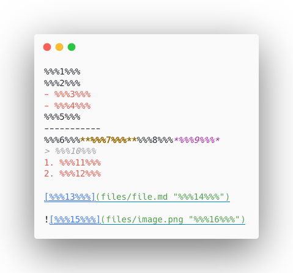
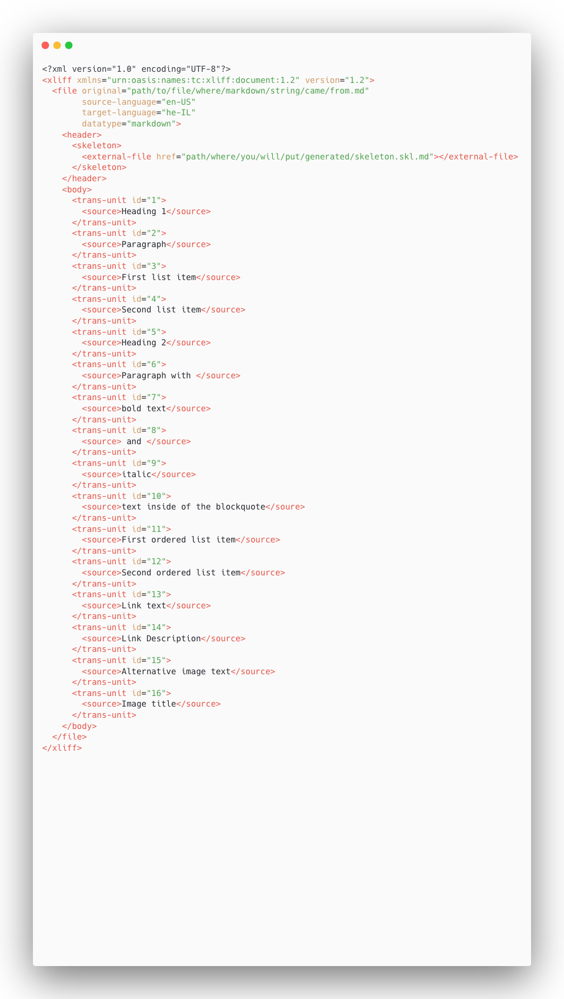
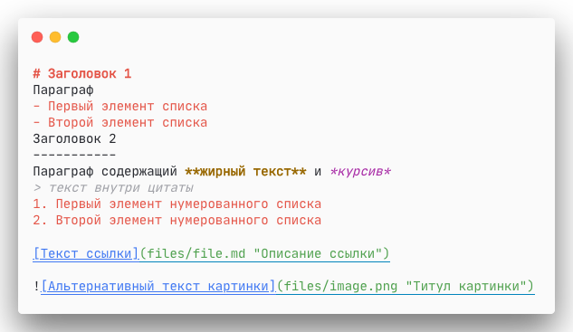

# @diplodoc/translation

## 📚 Sections

- [👋 Introduction](#-introduction)

- [🌟 Project Overview](#-project-overview)

- [🎯 Purpose and Scope](#-purpose-and-scope)

- [🚀 Getting Started](#-getting-started)

- [💻 Installation](#-installation)

- [📖 API](#-api)

- [💡 Usage](#-usage)

## 👋 Introduction

Hey, There! 🤙🏼

Are you tired of copying and pasting your markdown content into translation tools, seeing markdown syntax instead of translatable text and collisions?

Say no more! 👌

With `@diplodoc/translation`, you can generate skeleton/XLIFF for CAT tools and compose translated Markdown back.

## 🌟 Project Overview

🚀💻 This library got you covered with two API interfaces: extract and compose. 💻🚀

Extract text from markdown files 📄 and generate a skeleton/XLF file. 🧑‍💻

Compose the extracted text with the translations from the XLF file to create the translated markdown file. 🌎📄💬

Say goodbye to manual translation work and streamline your workflow with `@diplodoc/translation`.

## 🎯 Purpose and Scope

🤯 Hold on to your hats, folks! This library is tackling some serious problems with markdown translations!

🚫 Say goodbye to unnecessary heavy load on translators caused by naive approaches that include markdown syntax constructs into text segments.

💥 And don't even get us started on "collisions" - yikes! But fear not, this library has got your back with a reliable solution for extracting text content from markdown without those pesky collisions.

🕵️‍♀️ How? By parsing and rendering xlf and skeleton, of course! So sit back, relax, and let this library handle all your markdown translation needs.

Say goodbye to those pesky issues and hello to efficient and accurate translations with `@diplodoc/translation`.

## 🚀 Getting Started

### 💻 Installation

```
npm install @diplodoc/translation
```

### 📖 API

#### 🔍 extract ✨

This function extracts skeleton and XLF strings from a given markdown string 📝, to use in the 💻 Computer Assisted Translation tool. 🌟

```typescript
function extract(parameters: ExtractParameters): ExtractOutput;
```

#### 🎛️ Parameters `Object`

| Name           | Type             | Description                                               |
| -------------- | ---------------- | --------------------------------------------------------- |
| `markdown`     | `string`         | The markdown string to extract text content from.         |
| `source`       | `LanguageLocale` | The source language and locale.                           |
| `target`       | `LanguageLocale` | The target language and locale.                           |
| `skeletonPath` | `string`         | The path where you will put the skeleton file.         |
| `markdownPath` | `string`         | The path from where the markdown file were read.         |

#### 📚 Types

#### 🎛️ LanguageLocale `Object`

| Name       | Type     | Description                                                   |
| ---------- | -------- | ------------------------------------------------------------- |
| `language` | `string` | The language code, as described in ISO 639-1.                 |
| `locale`   | `string` | The locale code in alpha-2 format, as described in ISO 3166-1 |

#### 🎛️ ExtractOutput `Object`

| Name       | Type     | Description                                               |
| ---------- | -------- | --------------------------------------------------------- |
| `skeleton` | `string` | The extracted skeleton string.                            |
| `xlf`      | `string` | The extracted XLF string.                                 |

#### 🔤 compose ✨

This function composes 🔠 translated 📝 markdown from given 🧟‍♂️ skeleton and 💬 XLF.

```typescript
function compose(parameters: ComposeParameters): string
```

#### 🎛️ Parameters `Object`

| Name           | Type             | Description                                               |
| -------------- | ---------------- | --------------------------------------------------------- |
| `skeleton`     | `string`         | The skeleton with hashes instead of translatable text     |
| `xlf`          | `string`         | XLF with translated text                                  |

### 👨‍💻 Usage

#### 🔍 Extract

Extract skeleton and xlf from markdown

#### 👀 Example

```typescript
import {extract} from '@diplodoc/translation';

const markdown = `# Heading 1

Paragraph

- First list item
- Second list item

Heading 2
-----------

Paragraph with **bold text** and *italic*

> text inside of the blockquote

1. First ordered list item
2. Second ordered list item

[Link text](files/file.md "Link Description")


`;

const params = {
    markdown,
    source: {language: 'en', locale: 'US' as const},
    target: {language: 'ru', locale: 'RU' as const},
    skeletonPath: 'path/where/you/will/put/generated/skeleton.skl.md',
    markdownPath: 'path/to/file/where/markdown/string/came/from.md',
}

const {skeleton, xlf} = extract(params);

console.log(skeleton);
console.log(xlf);
```

#### 💥 Output





#### 🔤 Compose

Compose skeleton and xlf into translated markdown

#### 👀 Example

```typescript
import {compose} from '@diplodoc/translation';

const skeleton = `%%%1%%%
%%%2%%%
- %%%3%%%
- %%%4%%%
%%%5%%%
-----------
%%%6%%%**%%%7%%%**%%%8%%%*%%%9%%%*
> %%%10%%%
1. %%%11%%%
2. %%%12%%%

[%%%13%%%](files/file.md "%%%14%%%")


`

const xlf = `<?xml version="1.0" encoding="UTF-8"?>
<xliff xmlns="urn:oasis:names:tc:xliff:document:1.2" version="1.2">
  <file original="text.md" source-language="ru-RU" target-language="en-US" datatype="markdown">
    <header>
      <skeleton>
        <external-file href="text.skl.md"></external-file>
      </skeleton>
    </header>
    <body>
      <trans-unit id="1">
        <source>Heading 1</source>
        <target>Заголовок 1</target>
      </trans-unit>
      <trans-unit id="2">
        <source>Paragraph</source>
        <target>Параграф</target>
      </trans-unit>
      <trans-unit id="3">
        <source>First list item</source>
        <target>Первый элемент списка</target>
      </trans-unit>
      <trans-unit id="4">
        <source>Second list item</source>
        <target>Второй элемент списка</target>
      </trans-unit>
      <trans-unit id="5">
        <source>Heading 2</source>
        <target>Заголовок 2</target>
      </trans-unit>
      <trans-unit id="6">
        <source>Paragraph with </source>
        <target>Параграф содержащий </target>
      </trans-unit>
      <trans-unit id="7">
        <source>bold text</source>
        <target>жирный текст</target>
      </trans-unit>
      <trans-unit id="8">
        <source> and </source>
        <target> и </target>
      </trans-unit>
      <trans-unit id="9">
        <source>italics</source>
        <target>курсив</target>
      </trans-unit>
      <trans-unit id="10">
        <source>text inside of the blockquote</source>
        <target>текст внутри цитаты</target>
      </trans-unit>
      <trans-unit id="11">
        <source>First ordered list item</source>
        <target>Первый элемент нумерованного списка</target>
      </trans-unit>
      <trans-unit id="12">
        <source>Second ordered list item</source>
        <target>Второй элемент нумерованного списка</target>
      </trans-unit>
      <trans-unit id="13">
        <source>Link text</source>
        <target>Текст ссылки</target>
      </trans-unit>
      <trans-unit id="14">
        <source>Link Description</source>
        <target>Описание ссылки</target>
      </trans-unit>
      <trans-unit id="15">
        <source>Alternative image text</source>
        <target>Альтернативный текст картинки</target>
      </trans-unit>
      <trans-unit id="16">
        <source>Image title</source>
        <target>Титул картинки</target>
      </trans-unit>
    </body>
  </file>
</xliff>
`;

const markdown = compose({skeleton, xlf});

console.log(markdown);
```

#### 💥 Output


